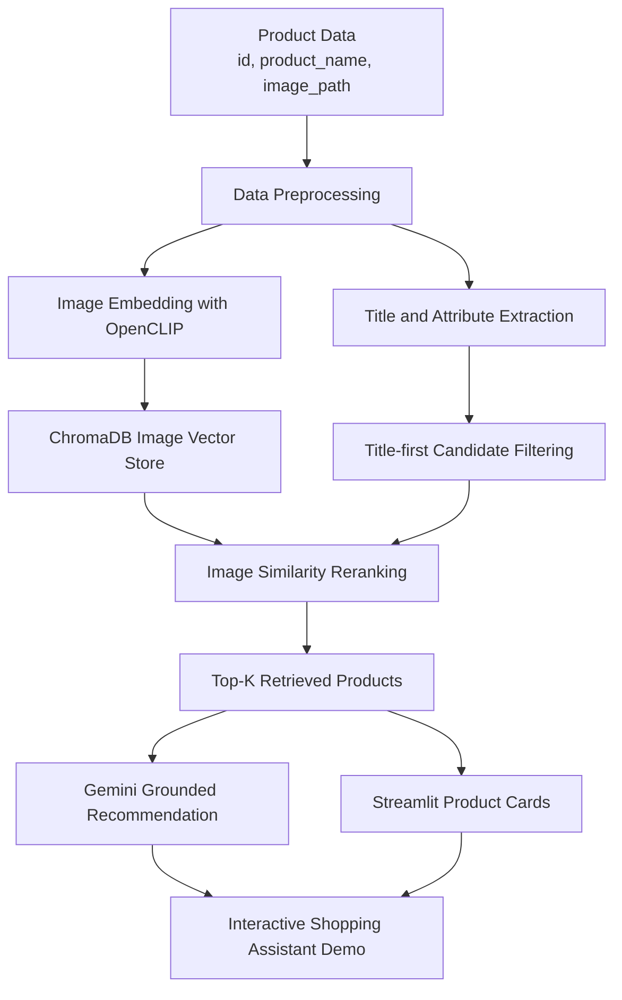

# 快時尚服飾商品搜尋與導購

## 中文版

## 專案簡介

本專案是一個多模態時尚商品搜尋與導購 Demo，使用 **Python、OpenCLIP、ChromaDB、Streamlit 與 Gemini API** 建置。

系統以快時尚電商商品資料為基礎，原始資料主要包含商品 ID、商品名稱與商品圖片路徑。由於資料屬於弱標註資料，缺乏完整商品描述與人工標籤，因此本專案採用 **Title-first Hybrid Retrieval** 架構。

系統會先根據商品名稱與分類篩選候選商品，再透過 OpenCLIP 圖片向量進行相似度 reranking，最後將檢索結果傳入 Gemini API，生成有依據的導購式推薦回答。

> 在 v0.2 中，Gemini 不直接判讀商品圖片；圖片資訊已透過 OpenCLIP 圖片向量參與檢索與排序。

---

## 核心功能

- 結合商品名稱與圖片向量進行多模態商品搜尋
- 針對弱標註商品資料，採用商品名稱優先的候選篩選策略
- 使用 OpenCLIP 圖片向量進行相似度重新排序
- 使用 ChromaDB 建立本地圖片向量資料庫
- 使用 Streamlit 建立互動式商品搜尋展示介面
- 使用 Gemini API 根據檢索結果生成導購式推薦回答
- 前端顯示總分、名稱分數與圖片分數，提升推薦結果可解釋性

---

## 系統架構



---

## 技術棧

- Python
- OpenCLIP
- ChromaDB
- Streamlit
- Gemini API
- Pandas
- NumPy
- Pillow
- Matplotlib
- scikit-learn

---

## 專案結構

```text
fashion_rag_project/
├── app.py
├── scripts/
│   ├── 01_prepare_data.py
│   ├── 02_build_vector_db.py
│   ├── 04_prepare_product_attributes.py
│   ├── 06_generate_english_caption.py
│   ├── 07_build_text_vector_db.py
│   ├── 09_title_first_search_demo.py
│   ├── 10_dataset_query_audit.py
│   ├── 12_evaluate_precision_at_k.py
│   └── llm_recommender.py
├── docs/
│   └── decision_log.md
├── requirements.txt
├── README.md
└── .gitignore
```

---

## 執行方式

### 1. 建立並啟動虛擬環境

```bash
python -m venv .venv
```

Windows PowerShell：

```powershell
.\.venv\Scripts\Activate.ps1
```

### 2. 安裝套件

```bash
pip install -r requirements.txt
```

### 3. 設定 Gemini API Key

在專案根目錄建立 `.env` 檔案：

```env
GEMINI_API_KEY=your_gemini_api_key
GEMINI_MODEL=gemini-1.5-flash
```

請確認 `.env` 不會上傳到 GitHub：

```gitignore
.env
```

### 4. 啟動 Streamlit Demo

```bash
streamlit run app.py
```

啟動後，系統會開啟本機網頁介面，可輸入商品或穿搭需求進行搜尋。

---

## 建議展示查詢

目前資料較適合支援商品特徵明確、候選數充足的查詢，例如：

```text
白色高領上衣
黑色短裙
海邊度假風洋裝
甜美短裙
灰色大衣
復古洋裝
休閒短褲
```

---

## 評估結果

本專案使用 **Precision@5** 進行簡單人工評估。每個查詢取 Top 5 商品，並人工標記每筆結果是否符合查詢需求。

本次評估查詢集中，僅納入目前資料前處理後仍有足夠候選商品的品類；候選數不足或在資料清理階段已大量移除的品類，暫不納入本次 v0.2 評估。

| 查詢           | Precision@5 |
| -------------- | ----------: |
| 白色高領上衣   |        1.00 |
| 黑色短裙       |        1.00 |
| 海邊度假風洋裝 |        0.80 |
| 甜美短裙       |        1.00 |
| 灰色大衣       |        1.00 |
| 復古洋裝       |        1.00 |
| 休閒短褲       |        0.80 |
| **平均**       |   **0.943** |

評估結果顯示，系統在商品類別明確且候選數充足的查詢上表現良好，例如高領上衣、短裙、洋裝、大衣與短褲。對於候選數不足或商品標籤較混雜的類別，後續仍需要更完整的視覺屬性標註與資料補強。

---

## 版本紀錄

### v0.1：多模態商品搜尋 Demo

- 使用 OpenCLIP、ChromaDB 與 Streamlit 建立商品搜尋 Demo
- 實作 Title-first candidate filtering
- 使用圖片向量相似度進行 reranking
- 加入 Query Audit，檢查資料集對不同查詢的支援程度

### v0.2：Gemini 導購式推薦回答

- 加入 Gemini API，根據檢索結果生成導購式推薦回答
- LLM 僅使用檢索出的商品資料、系統標籤與檢索分數
- 圖片資訊透過 OpenCLIP reranking 間接參與推薦，而非由 Gemini 直接判讀圖片
- 加入 Precision@5 人工評估，檢查第一版 Demo 在主要展示查詢上的檢索品質

---

## 目前限制

目前版本使用的是弱標註商品資料，主要依賴商品名稱與商品圖片。由於原始資料缺乏完整的人工商品屬性標籤，例如實際顏色、領口、袖長、正式程度與適用場合，因此部分較精細的導購查詢可能無法穩定取得理想結果。

較困難的查詢例子：

```text
適合上班的簡約襯衫
氣質通勤翻領長袖襯衫
```

這類查詢需要更乾淨且更完整的商品屬性資料。若資料中缺乏足夠候選商品，即使使用多模態向量檢索，也可能受到商品名稱混雜或標籤不足影響。

---

## 未來改進方向

- 使用 Vision-Language Model 自動補充商品圖片屬性
- 建立更可靠的視覺標籤，例如顏色、領口、袖長、版型、風格與場合
- 讓 Gemini 或其他多模態模型直接分析 Top-K 商品圖片
- 建立更完整的 Precision@K / Recall@K / nDCG 等檢索評估指標
- 建立可公開的 sample dataset，讓 GitHub 專案可重現
- 將 Demo 部署到雲端平台，方便線上展示

---

# Fast-Fashion Product Search and Shopping Assistant

## English Version

## Project Overview

This project is a multimodal fashion product search and shopping assistant demo built with **Python, OpenCLIP, ChromaDB, Streamlit, and Gemini API**.

The system is based on fast-fashion e-commerce product data. The original dataset mainly contains product IDs, product names, and product image paths. Since the dataset is weakly labeled and lacks complete product descriptions and manually verified attributes, this project adopts a **Title-first Hybrid Retrieval** architecture.

The system first filters candidate products based on product names and categories, then applies OpenCLIP image embeddings for similarity reranking. Finally, the retrieved results are passed to Gemini API to generate grounded shopping recommendation responses.

> In v0.2, Gemini does not directly inspect product images. Image information is incorporated through OpenCLIP-based image embeddings during retrieval and ranking.

---

## Key Features

- Multimodal product search using product names and image embeddings
- Title-first candidate filtering strategy for weakly labeled product data
- Image similarity reranking with OpenCLIP embeddings
- Local vector database built with ChromaDB
- Interactive product search demo interface built with Streamlit
- Grounded shopping recommendation generation using Gemini API
- Interpretable ranking scores displayed on the frontend, including final score, title score, and image score

---

## System Architecture


---

## Tech Stack

- Python
- OpenCLIP
- ChromaDB
- Streamlit
- Gemini API
- Pandas
- NumPy
- Pillow
- Matplotlib
- scikit-learn

---

## Project Structure

```text
fashion_rag_project/
├── app.py
├── scripts/
│   ├── 01_prepare_data.py
│   ├── 02_build_vector_db.py
│   ├── 04_prepare_product_attributes.py
│   ├── 06_generate_english_caption.py
│   ├── 07_build_text_vector_db.py
│   ├── 09_title_first_search_demo.py
│   ├── 10_dataset_query_audit.py
│   ├── 12_evaluate_precision_at_k.py
│   └── llm_recommender.py
├── docs/
│   └── decision_log.md
├── requirements.txt
├── README.md
└── .gitignore
```

---

## How to Run

### 1. Create and activate a virtual environment

```bash
python -m venv .venv
```

For Windows PowerShell:

```powershell
.\.venv\Scripts\Activate.ps1
```

### 2. Install dependencies

```bash
pip install -r requirements.txt
```

### 3. Configure Gemini API Key

Create a `.env` file in the project root directory:

```env
GEMINI_API_KEY=your_gemini_api_key
GEMINI_MODEL=gemini-1.5-flash
```

Make sure `.env` is not uploaded to GitHub:

```gitignore
.env
```

### 4. Launch the Streamlit Demo

```bash
streamlit run app.py
```

After launching the app, a local web interface will open. Users can enter product or outfit-related queries to search for recommended products.

---

## Recommended Demo Queries

The current dataset works better for queries with clear product features and sufficient candidate products, such as:

```text
white turtleneck top
black mini skirt
beach vacation dress
sweet mini skirt
gray coat
vintage dress
casual shorts
```

Chinese demo queries:

```text
白色高領上衣
黑色短裙
海邊度假風洋裝
甜美短裙
灰色大衣
復古洋裝
休閒短褲
```

---

## Evaluation Results

This project uses **Precision@5** for a small-scale manual evaluation. For each query, the top 5 retrieved products were manually labeled as relevant or not relevant to the query intent.

The evaluation set only includes product categories with sufficient candidates after data preprocessing. Categories with insufficient candidates or categories heavily affected by data cleaning are not included in the v0.2 evaluation.

| Query          | Precision@5 |
| -------------- | ----------: |
| 白色高領上衣   |        1.00 |
| 黑色短裙       |        1.00 |
| 海邊度假風洋裝 |        0.80 |
| 甜美短裙       |        1.00 |
| 灰色大衣       |        1.00 |
| 復古洋裝       |        1.00 |
| 休閒短褲       |        0.80 |
| **Average**    |   **0.943** |

The evaluation results show that the system performs well on queries with clear product categories and sufficient candidates, such as turtleneck tops, mini skirts, dresses, coats, and shorts. For categories with insufficient candidates or noisy product labels, further visual attribute extraction and data enhancement are still needed.

---

## Version History

### v0.1: Multimodal Product Search Demo

- Built a product search demo using OpenCLIP, ChromaDB, and Streamlit
- Implemented Title-first candidate filtering
- Applied image similarity reranking with OpenCLIP embeddings
- Added Query Audit to examine how well the dataset supports different types of queries

### v0.2: Gemini Shopping Recommendation

- Added Gemini API to generate shopping recommendation responses based on retrieved products
- The LLM only uses retrieved product metadata, system-generated labels, and retrieval scores
- Image information is indirectly incorporated through OpenCLIP reranking rather than direct image inspection by Gemini
- Added manual Precision@5 evaluation to assess retrieval quality for the main demo queries

---

## Current Limitations

The current version uses weakly labeled product data and mainly relies on product names and product images. Since the original dataset lacks complete manually verified product attributes, such as actual color, collar type, sleeve length, formality, and suitable occasion, some fine-grained shopping queries may not return stable or ideal results.

Examples of more difficult queries:

```text
office-style minimal blouse
elegant commuter long-sleeve collared shirt
```

These queries require cleaner and more complete product attribute data. If the dataset does not contain enough suitable candidate products, even multimodal vector retrieval may be affected by noisy product titles or insufficient labels.

---

## Future Improvements

- Use a Vision-Language Model to automatically generate product image attributes
- Build more reliable visual labels, such as color, collar type, sleeve length, fit, style, and occasion
- Allow Gemini or other multimodal models to directly analyze Top-K product images
- Build more comprehensive retrieval evaluation metrics, such as Precision@K, Recall@K, and nDCG
- Create a public sample dataset for reproducibility on GitHub
- Deploy the demo to a cloud platform for easier online portfolio presentation
